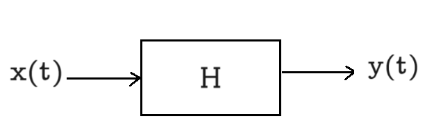
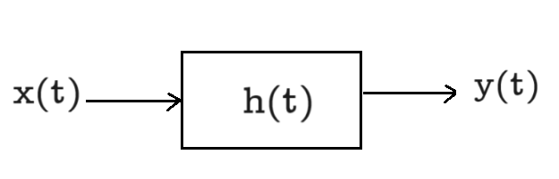

# Stable Systems # 

A system is said to be stable if for a bounded input, the output is also bounded i.e. bounded input bounded output (BIBO) stability

 

if $|x(t)| \leq B < \infty ~~\forall~ t,~\text{then for BIBO stabilty} \rightarrow |y(t)| \leq M < \infty ~\forall t$

## Example: ##

1) ${y}(t) = e^{x(t)}, ~~ |x(t)| \leq B $

    Solution: 

 $~~~~~~~~~~~~~~~~~~~~~~|y(t)| \leq e^{B} = M \quad \text{i.e. stable}$

 2) ${y}(t) = t x(t), ~~ |x(t)| \leq B $

    Solution: $|y(t)| ~\text{can not be bounded i.e. unstable}$

## LTI system with BIBO Stablity ##

A system is BIBO stable if and only if $\int_{-\infty} ^ \infty |h(t)| ~dt < \infty $ , i.e. h(t) is absolutely integrable. 