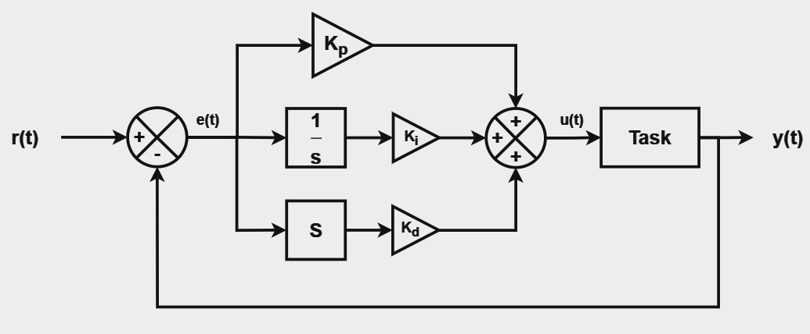

### Stable Systems

There are many notions of a stable system. Here we consider stability based on boundedness of input and output signals as defined next. A system is said to be stable if for any bounded input $x(t)$, the output $y(t)$ is also bounded, i.e., bounded input bounded output (BIBO) stability.

If $|x(t)| \leq B < \infty ~~\forall~ t$, then for BIBO stability we must have, $|y(t)| \leq M < \infty ~\forall t.$

Similarly, a discrete-time system is said to be BIBO stable if any bounded input signal gives a bounded output signal.

If $|x[n]| \leq B < \infty ~~\forall~ n$, then for BIBO stability, $|y[n]| \leq M < \infty ~\forall n.$

#### Examples

1. ${y}(t) = e^{x(t)}, ~~ |x(t)| \leq B $

   Solution:

$~~~~~~~~~~~~~~~~~~~~~~|y(t)| \leq e^{B} = M \quad \text{i.e. system is BIBO stable.}$

2. ${y}(t) = t x(t), ~~ |x(t)| \leq B $

   Solution:

$~~~~~~~~~~~~~~~~~~~~~~|y(t)| ~\text{cannot be bounded hence it is not BIBO stable.}$

### LTI systems with BIBO Stability

It can be shown that a linear and time invariant (LTI) system is BIBO stable if and only if $\int_{-\infty} ^ \infty |h(t)| ~dt < \infty$ ,i.e., the impulse response $h(t)$ is absolutely integrable. Similarly, for a discrete time LTI system, BIBO stability implies that the impulse response $h[n]$ is absolutely summable, i.e., $\sum_{-\infty}^{\infty} |h[n]| < \infty$.

#### Example

Find values of the complex parameter $a$ for which the discrete time LTI system with impulse response $h[n] = a^n u[n]$ is stable.

Solution:

$ \sum*{-\infty}^{\infty} h[n] = \sum*{0}^{\infty} h[n]$

$\quad \quad \quad \quad \quad = \sum_{0}^{\infty}a^n$

$\quad \quad \quad \quad \quad = \frac{1}{1-a}$

which converges only when $|a| < 1$. Thus the system is stable when the complex parameter $a$ is inside the unit circle in the complex plane.

### LTI system transfer function

Let an LTI system have rational transfer function given by,

$$H(s) = \frac{(s-z_1) \ldots (s-z_M)}{(s-p_1) \ldots (s-p_N)}.$$

For a causal system, the stability of the above system depends completely on the location of its poles. Specifically, for the system to be stable, all the poles should lie on the left half plane.

### PID Controller

A commonly used second order system is the Proportional–integral–derivative (PID) controller. A PID system block diagram is shown above. It is a feedback system with system function governed by the constants $K_p,$ $K_i,$ and $K_d$. The system function is given by,

$$H(s) = \frac{K(s)}{1+K(s)} \text{    where,}$$
$$K(s) = \frac{s^2 K_d + s K_p + K_i}{s}.$$

The stability of the system depends on the parameters $K_p,$ $K_i,$ and $K_d$.

The PID controller parameters influence system performance in terms of responsiveness, stability, and steady-state error. Increasing $K_p$ raises speed but reduces stability; increasing $K_i$ eliminates steady-state error but increases overshoot; and increasing $K_d$ improves stability and reduces overshoot.
